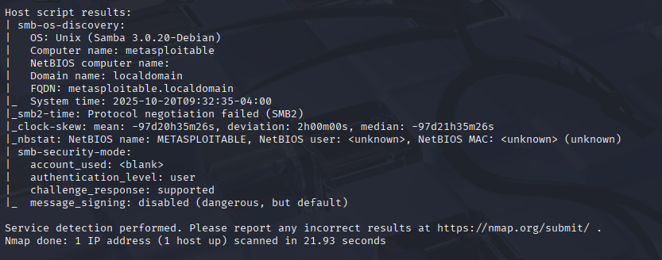
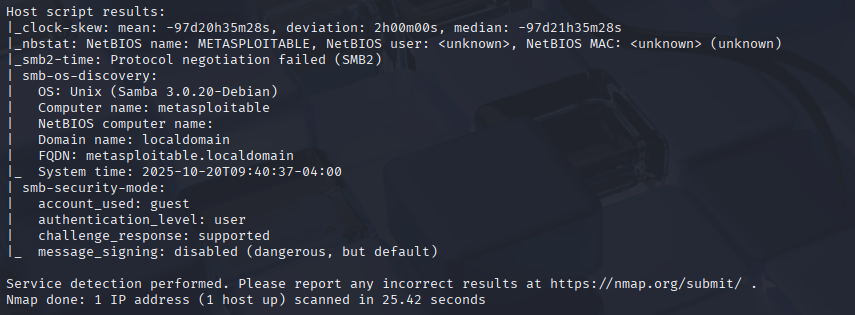
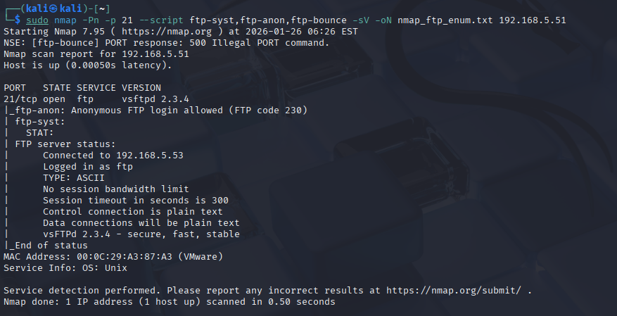
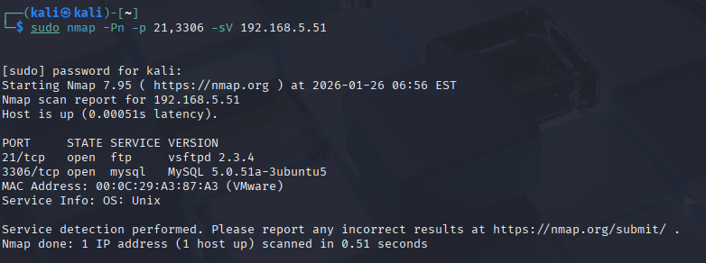
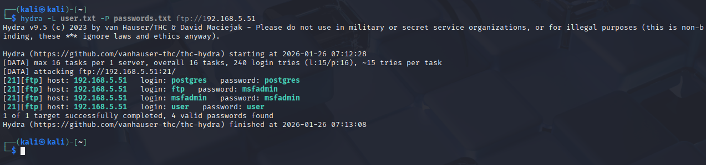

# ITSE Arbeitsbericht

Klasse: 4AHITS  
Name: Florian Zöhner   
Fach: ITSE-Labor   
Datum: 26.01.2026

# Vulnerability Scanning

## Übung (nmap enumeration)

Befehl: sudo nmap -Pn -sS -sV -sC -oN nmap_default.txt 192.168.5.51

### Bedeutung der Optionen

-Pn → kein Ping, Ziel wird als erreichbar angenommen

-sS → TCP SYN Scan (Half-Open, schnell & unauffällig)

-sV → Dienst- und Versionserkennung

-sC → Standard-NSE-Skripte (Enumeration)

-oN → Ausgabe in Datei speichern

### Besonderer Scan

SYN-Scan mit automatischer Enumeration und Versionsdetektion

Vorteil

Sehr schnelle Übersicht über:

offene Ports

Dienste + Versionen

erste Hinweise auf Schwachstellen

Anzahl gescannter Ports

Top 1000 TCP-Ports
Das Ergebnis sieht man mit dem Befehl: less nmap_default.txt

## Übung (vulnerability scan)

Skripte Anzeigen: 
ls /usr/share/nmap/scripts

Nach Kategorien suchen:
ls /usr/share/nmap/scripts | grep vuln

### Aufgabe 1
Befehl: sudo nmap -Pn -sS -sV -sC -F -oN nmap_fast_default.txt 192.168.5.51

### Aufgabe 2   

Befehl: sudo nmap -Pn -sS -sV --script \
banner,http-title,http-headers,ftp-anon,ssh-hostkey \
-oN nmap_custom_scripts.txt 192.168.5.51

Die Skripte banner, http-title, http-headers, ftp-anon und ssh-hostkey lieferten detaillierte Informationen über die laufenden Dienste. Unter anderem wurde der FTP-Dienst als vsftpd 2.3.4 identifiziert und anonymer FTP-Zugriff festgestellt. Der Webserver gibt den Titel „Metasploitable2“ sowie den Server-Header Apache/2.2.8 (Ubuntu) zurück.

### Aufgabe 3

FTP Enumeration
Befehl: sudo nmap -Pn -p 21 --script ftp-syst,ftp-anon,ftp-bounce -sV -oN nmap_ftp_enum.txt 192.168.5.51

### Aufgabe 4

Befehl: sudo nmap -Pn -p 21,80 --script vuln -sV -oN nmap_vuln_21_80.txt 192.168.5.51

Da der Scan sehr zeitintensiv ist, wurde er auf die Ports 21 (FTP) und 80 (HTTP) beschränkt. Der Scan identifizierte auf Port 21 den Dienst vsftpd 2.3.4 sowie erlaubten anonymen FTP-Zugriff, meldete jedoch keine konkrete CVE. Dies zeigt, dass der vuln-Scan nicht alle bekannten Schwachstellen automatisch erkennt und eine manuelle Analyse der ermittelten Dienstversionen notwendig ist.

## Übung (very safe FTP backdoor)

Auf Port 21 wurde der FTP-Dienst vsftpd 2.3.4 identifiziert. Für diese Version ist die Schwachstelle CVE-2011-2523 bekannt, bei der es sich um eine absichtlich eingebaute Backdoor handelt, die potenziell Remote Code Execution ermöglicht. Die Schwachstelle wurde nicht automatisch durch den vuln-Scan erkannt, sondern durch manuelle Analyse der ermittelten Dienstversion identifiziert.

# Login Vulnerabilites

## Übung (Online password guessing mit Hydra)

Befehl: sudo nmap -Pn -p 21,3306 -sV 192.168.5.51

User- und Passwortliste erstellen: 
nano users.txt
nano passwords.txt

Hydra Angriff auf FTP:
hydra -L users.txt -P passwords.txt ftp://192.168.5.51

Mittels Hydra wurde ein Online Password Guessing Angriff auf den FTP-Dienst (Port 21) der Metasploitable VM durchgeführt. Dabei konnten mehrere gültige Benutzer-/Passwort-Kombinationen ermittelt werden, unter anderem msfadmin:msfadmin sowie weitere schwache Standard-Zugangsdaten.
Hydra Angriff auf MySQL:
hydra -L users.txt -P passwords.txt mysql://192.168.5.51

