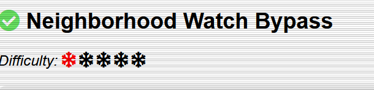
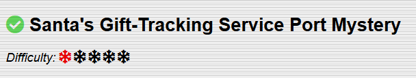
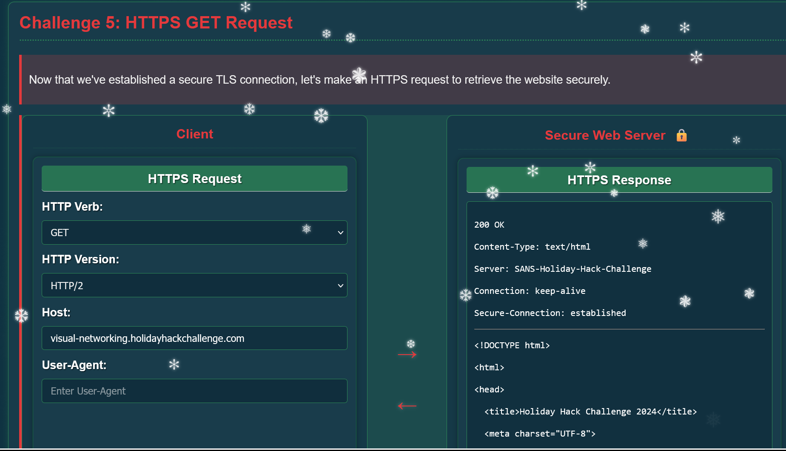
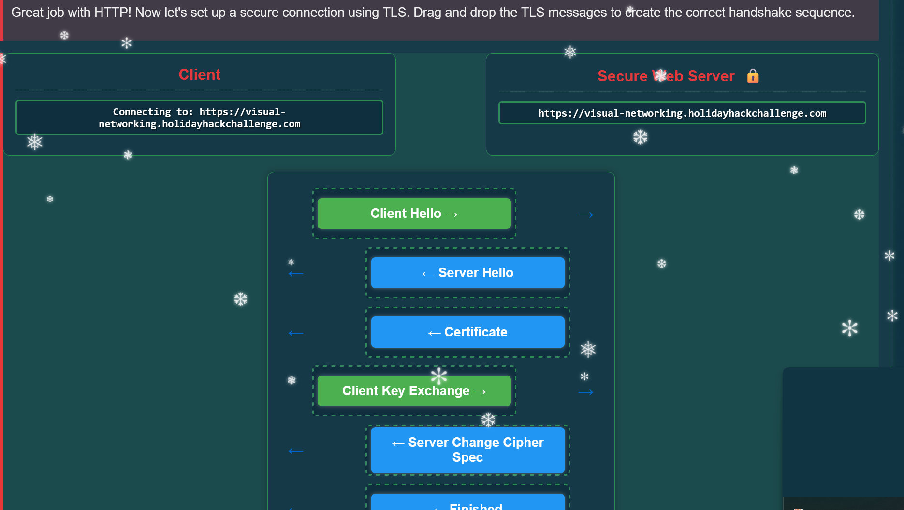
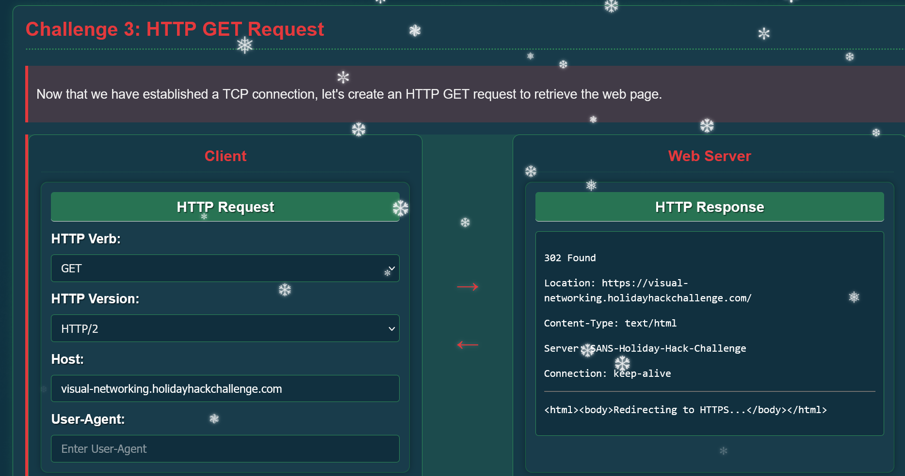
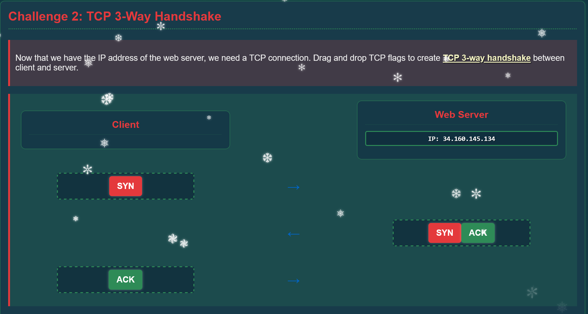
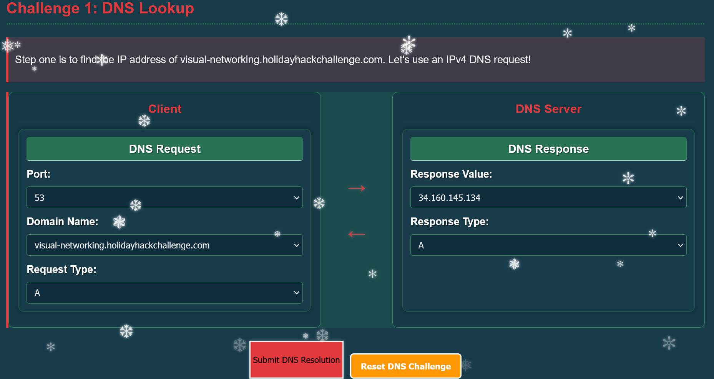

# ITP Arbeitsbericht

Klasse: 4AHITS  
Team: Florian Zöhner, Alexander Hauser  
Fach: ITP2  
Datum: 05.12.2025

## Holiday Hack Challenge
 
### Augabe 1

#### Lösung
Ins Terminal klicken ond "answer" eingeben.

### Aufgabe 2

#### Lösung
Teil 1:  
Domain: \b(?:[a-zA-Z0-9-]+\.)+(?!corp\b)(?!exe\b)(?!RENO\b)[a-zA-Z]{2,}\b 
 
IP-Address: \d{3}\.\d{1,3}\.\d{1,3}\.\d{1,3} 
 
URL: \bhttps?:\/\/(?:[a-zA-Z0-9-]+\.)+(?!corp\b)[a-zA-Z]{2,}(?::\d{1,5})?(?:\/\S*)?\b 
 
Email: \b[a-zA-Z0-9._%+-]+@(?:[a-zA-Z0-9-]+\.)+(?!corp\b)[a-zA-Z]{2,}\b 
  
Teil 2:  
Custom SED Command: s/\@/[@]/g; s/\./[.]/g; s/\:///[://]/g; s/\https/hxxps/g;

### Aufgabe 3

#### Lösung

Befehle: 
 
nano bin/w -> in der Datei dan das einfügen "/etc/firealarm/restore_fire_alarm" 
 
chmod 777 bin/w 
 
sudo -l -> Das Kopieren NOPASSWD: "/usr/local/bin/system_status.sh" 
 
sudo /usr/local/bin/system_status.sh

### Aufgabe 4

#### Lösung

Ich habe mit dem Befehl ss -tlnp den aktiven Port des Santa-Tracking-Dienstes ermittelt, der auf 12321 war. Anschließend habe ich mit telnet localhost 12321 erfolgreich eine Verbindung zum Dienst hergestellt und dessen Funktion überprüft.

Befehle: ss -tlnp, telnet localhost 12321

### Aufgabe 5

#### Lösung

 

 

 

 

 

