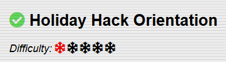

# ITP Arbeitsbericht

Klasse: 4AHITS  
Team: Florian Zöhner, Alexander Hauser  
Fach: ITP2  
Datum: 05.12.2025

## Holiday Hack Challenge
 
### Augabe 1

#### Lösung
Ins Terminal klicken ond "answer" eingeben.

### Aufgabe 2

#### Lösung
Teil 1:
Domain: \b(?:[a-zA-Z0-9-]+\.)+(?!corp\b)(?!exe\b)(?!RENO\b)[a-zA-Z]{2,}\b
IP-Address: \d{3}\.\d{1,3}\.\d{1,3}\.\d{1,3}
URL: \bhttps?:\/\/(?:[a-zA-Z0-9-]+\.)+(?!corp\b)[a-zA-Z]{2,}(?::\d{1,5})?(?:\/\S*)?\b
Email: \b[a-zA-Z0-9._%+-]+@(?:[a-zA-Z0-9-]+\.)+(?!corp\b)[a-zA-Z]{2,}\b
 
Teil 2:
Custom SED Command: s/\@/[@]/g; s/\./[.]/g; s/\:///[://]/g; s/\https/hxxps/g;

### Aufgabe 3

#### Lösung

